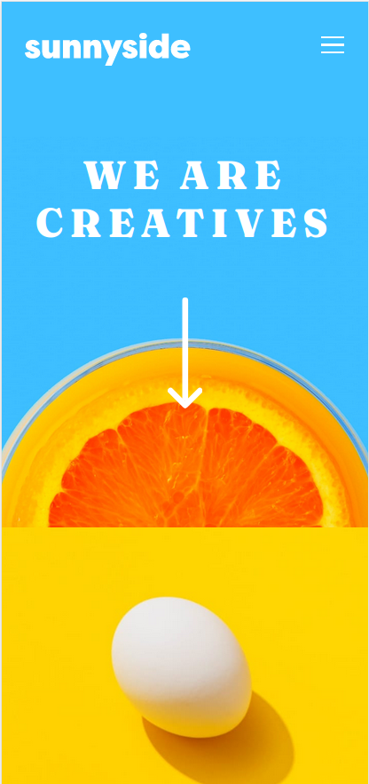
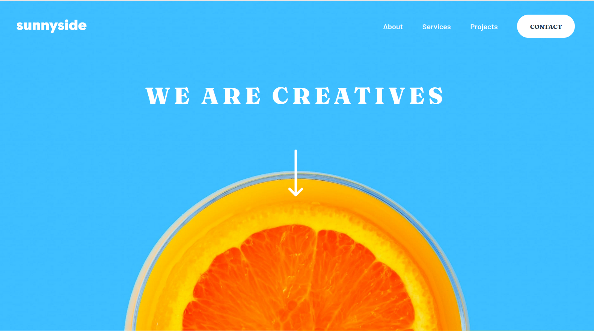

# sunnyside-agency
Becode exercise 12 : implement the designof a webpage given by a graphic designer.

## Briefing
[Instructions](https://github.com/becodeorg/CRL-KELLER-6/tree/main/1.TRAIL/1.The-Field/6.Sunnyside) for the exercise.

## Printscreen

## Used languages
HTML and CSS

## Authors
Virginie Dourson

## Date
09/2023

## Progression
WIP

## Github page
https://vdourson2.github.io/sunnyside-agency/